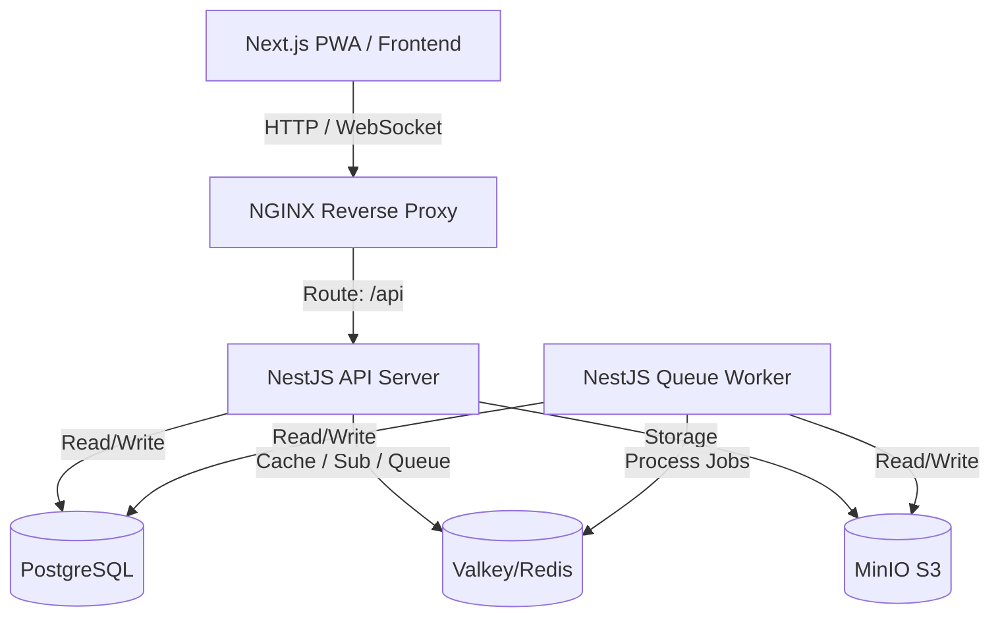

# SMEL-Plataforma de Eventos — Especificações Técnicas Completas (SPEC.md)

Este documento contém a especificação técnica completa, regras de negócio e arquitetura do ecossistema **SMEL-Plataforma de Eventos**, consolidando todas as especificações desenvolvidas das Levas 01 a 10.

---

## 1. Visão Geral da Arquitetura

A SMEL-Plataforma de Eventos é uma plataforma SaaS multi-tenant para gerenciamento de eventos corporativos e acadêmicos. O sistema foi desenvolvido sob princípios de **SOLID**, **Clean Architecture**, **DDD (Domain-Driven Design)**, conformidade **LGPD (Lei Geral de Proteção de Dados)**, e alta performance.

A arquitetura baseia-se em um **Monorepo** com a seguinte divisão:
* **`apps/api` (NestJS)**: API Gateway RESTful que expõe os endpoints do sistema, documentados via Swagger/OpenAPI. Lida com autenticação, autorização, cache e comunicação WebSocket.
* **`apps/worker` (NestJS Worker)**: Processador isolado em segundo plano que executa tarefas demoradas e intensivas via filas no **BullMQ** (como geração de certificados e envio de e-mails).
* **`apps/frontend` (Next.js 14)**: Interface administrativa e portal do participante (PWA) construída com React, Tailwind CSS e componentes shadcn/ui.
* **`packages/` (Bibliotecas Compartilhadas)**:
  * `@eventhub/types`: Tipos TypeScript comuns e payloads.
  * `@eventhub/shared`: Helpers, criptografia e utilitários.
  * `@eventhub/ui`: Design system e componentes React compartilhados.

---

## 2. Modelagem do Banco de Dados (Prisma Schema)

O banco de dados PostgreSQL utiliza um schema unificado com suporte a multi-inquilinato (multi-tenancy) e trilhas de auditoria:

* **`User`**: Cadastro de usuários com autenticação de dois fatores e controle de status.
* **`Tenant`**: Entidade da organização (empresa/organização) que encapsula seus próprios eventos e configurações de certificados.
* **`TenantMembership`**: Tabela associativa entre `User` e `Tenant`, contendo o campo `role` (`OWNER`, `ADMIN`, `ORGANIZER`, `CHECKER`, `MEMBER`).
* **`Event`**: Eventos pertencentes a uma organização com status (`DRAFT`, `PUBLISHED`, `FINISHED`, `CANCELLED`) e slug amigável (slugificação com autoincremento para evitar conflitos dentro da mesma organização).
* **`Category`, `Speaker`, `Sponsor`, `Schedule`**: Entidades acessórias e cronograma do evento.
* **`Registration`**: Inscrição vinculando `User` e `Event`, com status (`CONFIRMED`, `WAITLIST`, `CANCELLED`, `TRANSFERRED`) e dados sensíveis criptografados.
* **`CheckIn`**: Registro atômico de entrada do participante (portaria física), controlando duplicidade e operado offline/online.
* **`Certificate`**: Certificado digital associado a uma inscrição com código verificador único e rastreador de downloads.
* **`EmailLog`**: Histórico completo de comunicações por e-mail, tentativas e rastreabilidade de falhas (DLQ).
* **`AuditLog`**: Registro imutável de ações sensíveis (IP, User-Agent, ação, usuário e payload alterado).

---

## 3. Especificações dos Módulos Core

### 3.1. Autenticação e Segurança (Leva 02 / Leva 13)
* **Sessão Rotativa (JWT + HttpOnly Cookies)**:
  * O login gera um Access Token de 15 minutos (retornado em JSON) e um Refresh Token de 7 dias (injetado via cookie `HttpOnly`, `Secure`, `SameSite: Strict`).
  * Armazenamento e rotação dos tokens de atualização no Redis/Valkey (`refresh:${userId}:${tokenId}`) para revogação imediata no logout.
  * Fluxo silencioso de revalidação de tokens no cliente via interceptadores Axios (escuta `401 Unauthorized` e realiza o refresh automático).
* **Sessão Segura por Aba (sessionStorage)**:
  * O frontend grava a flag `smel_session_active = 'true'` no `sessionStorage` somente após login bem-sucedido.
  * Ao carregar o aplicativo (montagem inicial no `AuthProvider`), se a flag no `sessionStorage` não estiver presente (nova aba, janela fechada ou URL digitada diretamente), a renovação automática da sessão via cookie HttpOnly (`/auth/refresh`) é ignorada. Isso previne que a sessão antiga seja aberta automaticamente em abas novas ou navegadores recém-abertos.
  * A flag é limpa no `sessionStorage` ao realizar logout ou ao falhar na renovação automática do token (erro 401).
* **Revelador de Senha (Password Visibility Toggle)**:
  * Botão de visibilidade com ícone dinâmico (`Eye` e `EyeOff` da biblioteca `lucide-react`) integrado nos inputs de senha das telas de **Login** (`/login`), **Cadastro** (`/register`) e **Redefinição de Senha** (`/reset-password`).
  * Altera dinamicamente o atributo `type` do campo de senha entre `password` e `text`, garantindo o alinhamento visual e padding adequado para evitar sobreposição de caracteres com o ícone.

### 3.2. Multi-Tenancy e RBAC (Leva 03)
* **Isolamento de Dados**:
  * Injeção obrigatória do cabeçalho `X-Tenant-ID` nas requisições administrativas.
  * O `TenantInterceptor` valida a associação e injeta o objeto da organização no contexto.
  * Repositórios de banco herdam `TenantBaseRepository` que automaticamente concatena a cláusula `WHERE tenantId = :tenantId` nas queries, impedindo vazamento de dados.
* **Guarda de Permissões (RBAC)**:
  * Papéis atribuídos por organização. O decorador `@RequirePermission(...)` valida se o membro possui os privilégios mínimos de ação na organização correspondente antes de liberar o acesso à rota.
  * Restrições e privilégios específicos:
    * **Criação e Deleção**: Apenas `ADMIN`/`OWNER` (e o Superadmin) têm as permissões `events.create` e `events.delete` para criar e deletar eventos, bem como criar/editar categorias de eventos. O papel `ORGANIZER` não possui esses privilégios.
    * **Justificativa de Edição**: Embora o papel `ORGANIZER` possa editar detalhes operacionais do evento (como horários e vagas), toda atualização de evento exige obrigatoriamente o envio de uma justificativa textual detalhada, a qual é registrada no `AuditLog`.
    * **Isolamento de Convites e Organizações**: A criação de novas organizações (`Tenant`) e o envio de novos convites de participação no sistema são restritos unicamente à função global de **Superadmin**, não sendo permitidos aos administradores comuns (`ADMIN`/`OWNER`).
    * **Estabilidade de Interface (Memoização)**: O hook `usePermissions` expõe helpers de validação como `hasPermission` e a função de atualização `fetchPermissions` devidamente encapsulados sob `useCallback` (com dependências em `[permissions]` e `[user, tenantId]` respectivamente). Isso impede a recriação das funções a cada ciclo de renderização do React, evitando loops infinitos de re-fetch e desmontagens indevidas de modais de formulário ao digitar.

### 3.3. Ciclo de Vida do Evento e Upload (Leva 04)
* **Status**: Transição de estados controlada (`DRAFT` ➔ `PUBLISHED` ➔ `FINISHED`/`CANCELLED`).
* **Upload de Mídia**: Upload direto para o MinIO (S3 local) usando `UploadService` com validações rigorosas (tamanho máx. 5MB, tipos JPEG/PNG/WEBP).
* **Reordenação de Cronograma**: Endpoint transacional atômico (`PATCH /api/events/:id/schedule/reorder`) garantindo reordenação sequencial rápida.

### 3.4. Gestão de Inscrições e Concorrência (Leva 05)
* **Race Conditions (Locks Pessimistas)**:
  * Utilização de `SELECT FOR UPDATE` na tabela `Event` para validar a capacidade antes de confirmar inscrições concorrentes, prevenindo o *overbooking*.
* **Fila de Espera Automática**:
  * Excedida a capacidade, inscrições entram com o status `WAITLIST`.
  * No cancelamento de uma vaga confirmada, o participante mais antigo na fila de espera é promovido a `CONFIRMED` e sua posição é decrementada na fila, acionando o job de e-mail automático.
* **Criptografia de Dados e Blind Index (LGPD)**:
  * Armazenamento do CPF com criptografia simétrica `AES-256-GCM` na tabela do banco de dados para proteção de dados sensíveis.
  * Mascaramento padrão no formato `***.***.123-45` nos payloads normais. Exposição descriptografada restrita à permissão `registrations.view-cpf`.
  * **Prevenção de Duplicidade (Blind Index)**: Implementação do campo `cpfHash` indexado com unicidade por evento (`@@unique([eventId, cpfHash])`). O hash é gerado utilizando HMAC-SHA256 a partir do CPF limpo (somente dígitos) usando a `ENCRYPTION_KEY`. Permite busca rápida e bloqueio de cadastros duplicados no mesmo evento sem expor ou decodificar dados sensíveis.
  * **Validação de CPF**: Integração da validação matemática oficial do CPF (verificação de formato e cálculo dos dígitos verificadores) no fluxo de inscrição do participante, bloqueando cadastros de CPF inválido antes de salvar no banco de dados.

### 3.5. QR Code, Check-in e Scanner Offline (Leva 06 / Leva 14)
* **Assinatura Criptográfica**: Ingressos emitidos no formato de token JWT assinado (`QR_SECRET`) contendo identificadores essenciais.
* **Antiduplicidade**: Validação estrita contra múltiplos check-ins para o mesmo ingresso (retorna `409 Conflict` se já inserido).
* **Check-in por Ponto / Atividades / Oficinas**: O operador de portaria pode selecionar se o ponto de entrada é para o "Evento Principal" ou para uma "Atividade / Oficina específica". O sistema valida a matrícula do participante na atividade/oficina selecionada e registra o check-in isolado na atividade/oficina (evitando duplicidades).
* **Sincronização Offline**:
  * Operação offline via PWA móvel utilizando **Dexie.js** (IndexedDB) para cachear ingressos válidos (incluindo mapeamento de matrículas e presença nas atividades/oficinas) e reter check-ins efetuados localmente.
  * Sincronização em lote (`POST /api/checkin/sync`) com suporte a `workshopId` para processamento individualizado e transações atômicas das presenças coletadas sem rede.

### 3.6. Certificados Digitais e Layouts Dinâmicos (Leva 07 / Leva 14)
* **Modelos Externos e Customização**: Suporte à importação de modelos de layout externos configurados via painel administrativo. Cada organização/evento pode carregar uma imagem de fundo (background) customizada (`certificateLayoutUrl`) e um esquema de mapeamento de texto em formato JSON (`certificateLayoutJson`) contendo coordenadas (X, Y), tamanhos de fonte, alinhamentos e cores dos textos dinâmicos (Nome do Participante, Título do Evento, Carga Horária, Data e Código de Validação).
* **Emissão Específica e Dinâmica**: Permite a emissão e geração de certificados tanto para o Evento Principal (Entrada Geral) quanto para atividades/oficinas específicas do evento (ex: Abertura, Mesa Redonda, Oficinas).
* **Geração de PDF**: Processador de fila que renderiza o layout A4 paisagem dinamicamente. Se houver layout customizado, carrega a imagem externa como plano de fundo e posiciona os dados sobrepostos usando as coordenadas especificadas; caso contrário, utiliza o modelo institucional padrão da plataforma. Adiciona assinatura digital institucional, logotipo e QR Code vetorial público de validação.
* **Envio em Lote e Individual**: O painel administrativo permite emitir e enviar por e-mail os certificados individualmente ou em lote para todos os participantes que registraram presença.
* **Fila BullMQ**: Processamento assíncrono em segundo plano para evitar gargalos na API.
* **Validação Pública**: Endpoint público e sem autenticação para verificação rápida do código único do certificado com exibição visual de autenticidade.

### 3.7. Comunicação por E-mail (Leva 08)
* **Fila Centralizada**: `EmailService` agenda jobs no BullMQ.
* **Resiliência e Retry**: Atraso de reenvio exponencial (`backoff: exponential, 5s`) limitado a 3 tentativas.
* **Dead Letter Queue (DLQ)**: Jobs falhos persistentes são marcados como `DEAD` no banco para acompanhamento em painel dedicado no frontend.
* **Logs e Auditoria**: Cada envio cria um registro na tabela `EmailLog`.
* **Configuração de SMTP em Produção**: O sistema utiliza autenticação SMTP via porta `587` (TLS) com o e-mail institucional `eventos@educacao.luziania.go.gov.br`. Para contornar bloqueios de comunicação de rede na mesma sub-rede da VPS e do servidor de correio (isolamento de layer 2 do provedor), foi estabelecida uma rota persistente via gateway no Netplan (`/etc/netplan/99-custom-routes.yaml`), garantindo a entrega direta.

### 3.8. Dashboards e WebSocket (Leva 09)
* **Cache de Métricas**: Indicadores de visão geral da organização cacheados no Redis com TTL de 5 minutos.
* **Feeds em Tempo Real**: Websocket (`Socket.io`) estruturado por namespaces por Tenant (`/tenant-{tenantId}`) que envia transmissões imediatas de novos check-ins e alterações de inscrições para atualização dinâmica dos painéis sem refresh.

### 3.9. Gestão de Atividades / Oficinas e Palestrantes (Leva 12)
* **Modelagem de Dados**: Entidades relacionais `Workshop` (capacidade, horários de início e término, local, limite de vagas e palestrantes associados) e `WorkshopEnrollment` (vínculo de inscrições). Representadas visualmente como Atividades / Oficinas.
* **Concorrência e Vagas (Pessimistic Locking)**: Uso de travas pessimistas (`FOR UPDATE` na tabela `Workshop` durante a transação) para evitar condições de corrida (race conditions) e *overbooking* de vagas em inscrições simultâneas.
* **Detecção de Conflitos de Horário**: Validação automática e em tempo real que impede que um mesmo participante se inscreva em atividades/oficinas cujos horários se sobreponham (mesmo dia e horário de realização).
* **Ativação Dinâmica**: Arquitetura desacoplada e agnóstica; a funcionalidade de atividades/oficinas e palestrantes é ativada de forma transparente para qualquer evento cujo limite máximo de atividades/oficinas por participante (`maxWorkshops`) seja configurado com valor maior que zero.

### 3.10. Padronização de Nomes e Campos Obrigatórios (Leva 13)
* **Padronização em UPPERCASE**: Conversão automática de nomes dos participantes para letras maiúsculas tanto no frontend (ao digitar e na submissão) quanto no backend (como regra de integridade final na API antes de persistir no banco de dados).
* **Campos Obrigatórios Rigorosos**: O campo `phone` (Celular/Telefone) passou de opcional para estritamente obrigatório em todas as camadas da aplicação (DTOs de inscrição e transferência com `@IsNotEmpty()`, atributos HTML5 `required` no frontend e validações programáticas).
* **Tratamento Dinâmico de Erros**: O frontend foi aprimorado para capturar arrays de mensagens de validação retornados pela API e mesclá-los utilizando a formatação `. ` para exibição clara de múltiplos erros.

### 3.11. Localização Geográfica dos Eventos (Leva 13)
* **Geolocalização**: Suporte para cadastro e exibição do endereço físico e do link de mapas do evento.
* **Experiência do Participante**: Exibição de card visual dedicado na landing page do evento que direciona os participantes diretamente para serviços de rota (ex: Google Maps, Waze) através de um link persistente acionado por botão de navegação.

---

## 4. Auditoria, LGPD e Otimizações de Produção (Leva 10)

### 4.1. Trilha de Auditoria Completa
* Ações de ciclo de vida (login, logout, criação/edição de recursos, remoção, alteração de permissões, downloads de relatórios com dados sensíveis e acessos não autorizados) gravam logs permanentes de auditoria.
* **Captura de Metadados**: Registro consistente de IPs (incluindo headers proxy como `x-forwarded-for`) e User-Agents dos clientes.

### 4.2. Direito ao Esquecimento LGPD
* **Exclusão de Conta (`DELETE /api/auth/me`)**:
  * O processo realiza a anonimização de todos os dados pessoais do usuário em suas inscrições (`Registration`) e perfil (`User`).
  * Nomes substituídos por hashes (`User-XXXX`), e-mails, CPFs e telefones zerados ou genéricos.
  * Logs de IP e User-Agent em auditorias antigas pertencentes ao usuário excluído são zerados para garantir anonimato irreversível.
* **Retenção de Logs**: Crons semanais executados via fila que removem logs antigos (`EmailLog` > 90 dias, `AuditLog` > 5 anos).

### 4.3. Rate Limiting (Throttling)
* Utilização de `@nestjs/throttler` com storage Redis:
  * **Público**: 30 requisições / min.
  * **Auth**: 100 requisições / min.
  * **Check-in**: 60 requisições / min.
* `CustomThrottlerGuard` customizado que retorna erros em JSON com status `429 Too Many Requests`.

### 4.4. Cache e Invalidação Redis
* Cache ativo com invalidação no write em rotas críticas:
  * `GET /api/events/:id` (TTL 1m)
  * `GET /api/events/slug/:slug` (TTL 5m)
  * `GET /api/tenants/:id` (TTL 10m)

### 4.5. PWA e Visão Offline
* Configuração do `@ducanh2912/next-pwa` no Next.js com rota de offline dedicada `/offline` e componente de instalação interativo.

### 4.6. PM2, Helmets e Segurança de Containers
* Otimização de Dockerfiles para multi-stage com isolamento de privilégios rodando sob o usuário `node` (non-root).
* PM2 em clustering para API NestJS com script `ecosystem.config.js`.
* Integração de `helmet` e CORS controlados na API REST.

---

## 5. Gestão Global de Superadmin, Hardening e Localização PT-BR (Leva 11)

### 5.1. Painel Global Superadmin
* **Autenticação Restrita**: Rota do painel de administração global (`/superadmin`) e seus endpoints backend correspondentes protegidos por `SuperadminGuard`.
* **Identidade Única**: O e-mail `valterpcjr@gmail.com` é configurado como o único Superadmin do ecossistema. Qualquer requisição de outros usuários a endpoints sob o escopo do guard é rejeitada com `403 Forbidden`.
* **Segurança de Escopo (`@SkipTenant`)**: Os endpoints do Superadmin usam a anotação `@SkipTenant()` para ignorar o requisito padrão de cabeçalho `X-Tenant-ID`, permitindo consultas globais de estatísticas, tenants e usuários.
* **Criação de Organizações e Convites**: A criação de novas organizações (`Tenant`) e o envio de novos convites de participação no sistema são restritos unicamente ao Superadmin. Administradores comuns de organizações (`ADMIN`/`OWNER`) não têm permissão para criar organizações ou enviar novos convites globais.
* **Remoção do Auto-Cadastro (Hardening)**: O link público de auto-cadastro ("Cadastre-se grátis") na tela de login foi completamente removido. O registro de novos usuários organizadores é restrito, exigindo criação administrativa para impedir logins avulsos sem convite.
* **Exclusão Definitiva de Usuários**: Implementado endpoint seguro de exclusão física `DELETE /superadmin/users/:id` com dupla confirmação no painel frontend. A deleção limpa as tabelas associativas (`TenantMembership` e `Registration`) em cascata, mantendo a integridade histórica de `AuditLog` ao setar referências de usuário deletado como nulas, impedindo a auto-exclusão do administrador operando e do Superadmin principal.

### 5.2. Bloqueio Seguro e Conservação de Histórico (Auditoria)
* **Ativação/Desativação de Organizações**: A desativação de organizações altera o campo `isActive` para `false` no modelo `Tenant`.
* **Proteção de Dados Integros**: Em conformidade com a retenção para segurança de auditoria legal, nenhuma exclusão física de banco de dados (`DELETE`) é efetuada ao desativar organizações ou usuários.
* **Middleware Interceptor**: O `TenantInterceptor` intercepta todas as rotas com escopo de tenant e bloqueia imediatamente requisições destinadas a organizações inativas com `403 Forbidden ("Tenant is inactive.")`, assegurando isolamento imediato de acesso sem destruição de dados.

### 5.3. Localização Padrão e Limpeza de Interface
* **Tradução de Status**: Todos os status de eventos no banco de dados (`DRAFT`, `PUBLISHED`, `FINISHED`, `CANCELLED`) são traduzidos e mapeados de forma consistente no frontend utilizando a constante `EVENT_STATUS_LABELS` (`Rascunho`, `Publicado`, `Finalizado`, `Cancelado`).
* **Experiência do Usuário (UX/UI)**: Mapeamento de badges coloridos e listagens localizadas para garantir uma interface nativa em português sem dependência de pacotes de tradução externos pesados.
* **Ocultação de Metadados de Desenvolvimento**: Remoção completa de badges de status internos do cabeçalho da página inicial do painel (como a tag `SMEL-Plataforma de Eventos Leva 03 — Multi-Tenant + RBAC`) para apresentar um ambiente polido, limpo e profissional em produção.

### 3.12. Inscrições Extra-Ingresso e Transferências (Leva 15)
* **Inscrições Extra-Ingresso (Inscrições na Hora)**:
  * Permite que operadores e organizadores realizem inscrições diretamente no local/dia do evento via painel administrativo (`POST /api/events/:id/extra-registration`).
  * O fluxo exige Nome, E-mail, CPF (com validação matemática e de duplicidade por blind index) e Telefone (obrigatório).
  * Permite selecionar as atividades/oficinas que o participante deseja frequentar, contanto que haja vagas remanescentes.
  * O sistema utiliza locks pessimistas (`SELECT FOR UPDATE`) para garantir integridade e evitar overbooking sob concorrência intensa de portaria.
  * O participante inscrito recebe imediatamente o e-mail de confirmação com seu QR Code de acesso.
* **Transferência de Atividades / Oficinas**:
  * Permite mover um participante de uma atividade/oficina para outra dentro do mesmo evento (`POST /api/registrations/:registrationId/transfer-workshop`), liberando a vaga de origem e ocupando a vaga na de destino.
  * Exige que a inscrição de origem esteja ativa (`CONFIRMED`), que a de destino possua vagas livres e que não ocorra sobreposição de horários com outras atividades em que o participante esteja matriculado.
  * O processo é realizado em uma única transação atômica do banco com locks de linha para proteção de concorrência.

### 3.13. Notificações Premium e Modais de Confirmação Customizados (Leva 15)
* **Notificações Premium (Toasts)**:
  * Sistema de alertas integrados em tempo real (`PremiumNotificationContext`) com design moderno de glassmorphism, sombras complexas e animações fluidas.
  * Substituição de alertas genéricos do sistema por avisos estilizados com suporte a múltiplos status (Sucesso, Erro, Info, Alerta).
* **Modais de Confirmação Customizados**:
  * Substituição de todos os diálogos de confirmação nativos do navegador (`window.confirm`) por modais React customizados e estilizados.
  * Suporte a modais padrão (Violeta) e modais destrutivos (Vermelho com ícone animado de perigo para ações irreversíveis como deleção de dados), enriquecidos com transições animadas (`animate-in fade-in zoom-in duration-200`) e desfoque de fundo (`backdrop-blur`).

