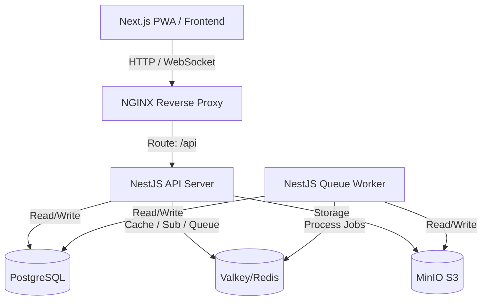

# SMEL-Plataforma de Eventos — Especificações Técnicas Completas (SPEC.md)

Este documento contém a especificação técnica completa, regras de negócio e arquitetura do ecossistema **SMEL-Plataforma de Eventos**, consolidando todas as especificações desenvolvidas das Levas 01 a 10.

---

## 1. Visão Geral da Arquitetura

A SMEL-Plataforma de Eventos é uma plataforma SaaS multi-tenant para gerenciamento de eventos corporativos e acadêmicos. O sistema foi desenvolvido sob princípios de **SOLID**, **Clean Architecture**, **DDD (Domain-Driven Design)**, conformidade **LGPD (Lei Geral de Proteção de Dados)**, e alta performance.

A arquitetura baseia-se em um **Monorepo** com a seguinte divisão:
* **`apps/api` (NestJS)**: API Gateway RESTful que expõe os endpoints do sistema, documentados via Swagger/OpenAPI. Lida com autenticação, autorização, cache e comunicação WebSocket.
* **`apps/worker` (NestJS Worker)**: Processador isolado em segundo plano que executa tarefas demoradas e intensivas via filas no **BullMQ** (como geração de certificados e envio de e-mails).
* **`apps/frontend` (Next.js 14)**: Interface administrativa e portal do participante (PWA) construída com React, Tailwind CSS e componentes shadcn/ui.
* **`packages/` (Bibliotecas Compartilhadas)**:
  * `@eventhub/types`: Tipos TypeScript comuns e payloads.
  * `@eventhub/shared`: Helpers, criptografia e utilitários.
  * `@eventhub/ui`: Design system e componentes React compartilhados.

---

## 2. Modelagem do Banco de Dados (Prisma Schema)

O banco de dados PostgreSQL utiliza um schema unificado com suporte a multi-inquilinato (multi-tenancy) e trilhas de auditoria:

* **`User`**: Cadastro de usuários com autenticação de dois fatores e controle de status.
* **`Tenant`**: Entidade inquilina (empresa/organização) que encapsula seus próprios eventos e configurações de certificados.
* **`TenantMembership`**: Tabela associativa entre `User` e `Tenant`, contendo o campo `role` (`OWNER`, `ADMIN`, `ORGANIZER`, `CHECKER`, `MEMBER`).
* **`Event`**: Eventos pertencentes a um inquilino com status (`DRAFT`, `PUBLISHED`, `FINISHED`, `CANCELLED`) e slug amigável (slugificação com autoincremento para evitar conflitos dentro do mesmo inquilino).
* **`Category`, `Speaker`, `Sponsor`, `Schedule`**: Entidades acessórias e cronograma do evento.
* **`Registration`**: Inscrição vinculando `User` e `Event`, com status (`CONFIRMED`, `WAITLIST`, `CANCELLED`, `TRANSFERRED`) e dados sensíveis criptografados.
* **`CheckIn`**: Registro atômico de entrada do participante (portaria física), controlando duplicidade e operado offline/online.
* **`Certificate`**: Certificado digital associado a uma inscrição com código verificador único e rastreador de downloads.
* **`EmailLog`**: Histórico completo de comunicações por e-mail, tentativas e rastreabilidade de falhas (DLQ).
* **`AuditLog`**: Registro imutável de ações sensíveis (IP, User-Agent, ação, usuário e payload alterado).

---

## 3. Especificações dos Módulos Core

### 3.1. Autenticação e Segurança (Leva 02)
* **Sessão Rotativa (JWT + HttpOnly Cookies)**:
  * O login gera um Access Token de 15 minutos (retornado em JSON) e um Refresh Token de 7 dias (injetado via cookie `HttpOnly`, `Secure`, `SameSite: Strict`).
  * Armazenamento e rotação dos tokens de atualização no Redis/Valkey (`refresh:${userId}:${tokenId}`) para revogação imediata no logout.
  * Fluxo silencioso de revalidação de tokens no cliente via interceptadores Axios (escuta `401 Unauthorized` e realiza o refresh automático).

### 3.2. Multi-Tenancy e RBAC (Leva 03)
* **Isolamento de Dados**:
  * Injeção obrigatória do cabeçalho `X-Tenant-ID` nas requisições administrativas.
  * O `TenantInterceptor` valida a associação e injeta o objeto inquilino no contexto.
  * Repositórios de banco herdam `TenantBaseRepository` que automaticamente concatena a cláusula `WHERE tenantId = :tenantId` nas queries, impedindo vazamento de dados.
* **Guarda de Permissões (RBAC)**:
  * Papéis atribuídos por organização. O decorador `@RequirePermission(...)` valida se o membro possui os privilégios mínimos de ação no inquilino correspondente antes de liberar o acesso à rota.

### 3.3. Ciclo de Vida do Evento e Upload (Leva 04)
* **Status**: Transição de estados controlada (`DRAFT` ➔ `PUBLISHED` ➔ `FINISHED`/`CANCELLED`).
* **Upload de Mídia**: Upload direto para o MinIO (S3 local) usando `UploadService` com validações rigorosas (tamanho máx. 5MB, tipos JPEG/PNG/WEBP).
* **Reordenação de Cronograma**: Endpoint transacional atômico (`PATCH /api/events/:id/schedule/reorder`) garantindo reordenação sequencial rápida.

### 3.4. Gestão de Inscrições e Concorrência (Leva 05)
* **Race Conditions (Locks Pessimistas)**:
  * Utilização de `SELECT FOR UPDATE` na tabela `Event` para validar a capacidade antes de confirmar inscrições concorrentes, prevenindo o *overbooking*.
* **Fila de Espera Automática**:
  * Excedida a capacidade, inscrições entram com o status `WAITLIST`.
  * No cancelamento de uma vaga confirmada, o participante mais antigo na fila de espera é promovido a `CONFIRMED` e sua posição é decrementada na fila, acionando o job de e-mail automático.
* **Criptografia de Dados (LGPD)**:
  * Armazenamento do CPF com criptografia simétrica `AES-256-GCM` na tabela do banco de dados.
  * Mascaramento padrão no formato `***.***.123-45` nos payloads normais. Exposição descriptografada restrita à permissão `registrations.view-cpf`.

### 3.5. QR Code, Check-in e Scanner Offline (Leva 06)
* **Assinatura Criptográfica**: Ingressos emitidos no formato de token JWT assinado (`QR_SECRET`) contendo identificadores essenciais.
* **Antiduplicidade**: Validação estrita contra múltiplos check-ins para o mesmo ingresso (retorna `409 Conflict` se já inserido).
* **Sincronização Offline**:
  * Operação offline via PWA móvel utilizando **Dexie.js** (IndexedDB) para cachear ingressos válidos e reter check-ins efetuados localmente.
  * Sincronização em lote (`POST /api/checkin/sync`) com processamento individualizado e transações atômicas.

### 3.6. Certificados Digitais (Leva 07)
* **Geração de PDF**: Processador de fila que renderiza um layout A4 paisagem, injeta assinatura digital institucional, logotipo da organização e QR Code vetorial público de validação.
* **Fila BullMQ**: Processamento assíncrono em segundo plano para evitar gargalos na API.
* **Validação Pública**: Endpoint público e sem autenticação para verificação rápida do código único do certificado com exibição visual de autenticidade.

### 3.7. Comunicação por E-mail (Leva 08)
* **Fila Centralizada**: `EmailService` agenda jobs no BullMQ.
* **Resiliência e Retry**: Atraso de reenvio exponencial (`backoff: exponential, 5s`) limitado a 3 tentativas.
* **Dead Letter Queue (DLQ)**: Jobs falhos persistentes são marcados como `DEAD` no banco para acompanhamento em painel dedicado no frontend.
* **Logs e Auditoria**: Cada envio cria um registro na tabela `EmailLog`.

### 3.8. Dashboards e WebSocket (Leva 09)
* **Cache de Métricas**: Indicadores de visão geral do inquilino cacheados no Redis com TTL de 5 minutos.
* **Feeds em Tempo Real**: Websocket (`Socket.io`) estruturado por namespaces por Tenant (`/tenant-{tenantId}`) que envia transmissões imediatas de novos check-ins e alterações de inscrições para atualização dinâmica dos painéis sem refresh.

---

## 4. Auditoria, LGPD e Otimizações de Produção (Leva 10)

### 4.1. Trilha de Auditoria Completa
* Ações de ciclo de vida (login, logout, criação/edição de recursos, remoção, alteração de permissões, downloads de relatórios com dados sensíveis e acessos não autorizados) gravam logs permanentes de auditoria.
* **Captura de Metadados**: Registro consistente de IPs (incluindo headers proxy como `x-forwarded-for`) e User-Agents dos clientes.

### 4.2. Direito ao Esquecimento LGPD
* **Exclusão de Conta (`DELETE /api/auth/me`)**:
  * O processo realiza a anonimização de todos os dados pessoais do usuário em suas inscrições (`Registration`) e perfil (`User`).
  * Nomes substituídos por hashes (`User-XXXX`), e-mails, CPFs e telefones zerados ou genéricos.
  * Logs de IP e User-Agent em auditorias antigas pertencentes ao usuário excluído são zerados para garantir anonimato irreversível.
* **Retenção de Logs**: Crons semanais executados via fila que removem logs antigos (`EmailLog` > 90 dias, `AuditLog` > 5 anos).

### 4.3. Rate Limiting (Throttling)
* Utilização de `@nestjs/throttler` com storage Redis:
  * **Público**: 30 requisições / min.
  * **Auth**: 100 requisições / min.
  * **Check-in**: 60 requisições / min.
* `CustomThrottlerGuard` customizado que retorna erros em JSON com status `429 Too Many Requests`.

### 4.4. Cache e Invalidação Redis
* Cache ativo com invalidação no write em rotas críticas:
  * `GET /api/events/:id` (TTL 1m)
  * `GET /api/events/slug/:slug` (TTL 5m)
  * `GET /api/tenants/:id` (TTL 10m)

### 4.5. PWA e Visão Offline
* Configuração do `@ducanh2912/next-pwa` no Next.js com rota de offline dedicada `/offline` e componente de instalação interativo.

### 4.6. PM2, Helmets e Segurança de Containers
* Otimização de Dockerfiles para multi-stage com isolamento de privilégios rodando sob o usuário `node` (non-root).
* PM2 em clustering para API NestJS com script `ecosystem.config.js`.
* Integração de `helmet` e CORS controlados na API REST.

---

## 5. Gestão Global de Superadmin e Localização PT-BR (Leva 11)

### 5.1. Painel Global Superadmin
* **Autenticação Restrita**: Rota do painel de administração global (`/superadmin`) e seus endpoints backend correspondentes protegidos por `SuperadminGuard`.
* **Identidade Única**: O e-mail `valterpcjr@gmail.com` é configurado como o único Superadmin do ecossistema. Qualquer requisição de outros usuários a endpoints sob o escopo do guard é rejeitada com `403 Forbidden`.
* **Segurança de Escopo (`@SkipTenant`)**: Os endpoints do Superadmin usam a anotação `@SkipTenant()` para ignorar o requisito padrão de cabeçalho `X-Tenant-ID`, permitindo consultas globais de estatísticas, tenants e usuários.

### 5.2. Bloqueio Seguro e Conservação de Histórico (Auditoria)
* **Ativação/Desativação de Organizações**: A desativação de organizações altera o campo `isActive` para `false` no modelo `Tenant`.
* **Proteção de Dados Integros**: Em conformidade com a retenção para segurança de auditoria legal, nenhuma exclusão física de banco de dados (`DELETE`) é efetuada ao desativar organizações ou usuários.
* **Middleware Interceptor**: O `TenantInterceptor` intercepta todas as rotas com escopo de tenant e bloqueia imediatamente requisições destinadas a organizações inativas com `403 Forbidden ("Tenant is inactive.")`, assegurando isolamento imediato de acesso sem destruição de dados.

### 5.3. Localização Padrão (Português-BR)
* **Tradução de Status**: Todos os status de eventos no banco de dados (`DRAFT`, `PUBLISHED`, `FINISHED`, `CANCELLED`) são traduzidos e mapeados de forma consistente no frontend utilizando a constante `EVENT_STATUS_LABELS` (`Rascunho`, `Publicado`, `Finalizado`, `Cancelado`).
* **Experiência do Usuário (UX/UI)**: Mapeamento de badges coloridos e listagens localizadas para garantir uma interface nativa em português sem dependência de pacotes de tradução externos pesados.

